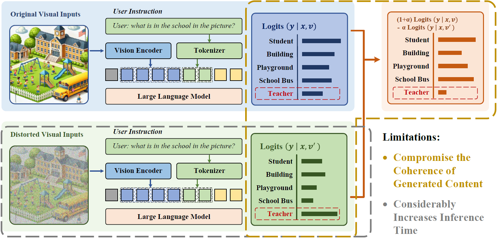
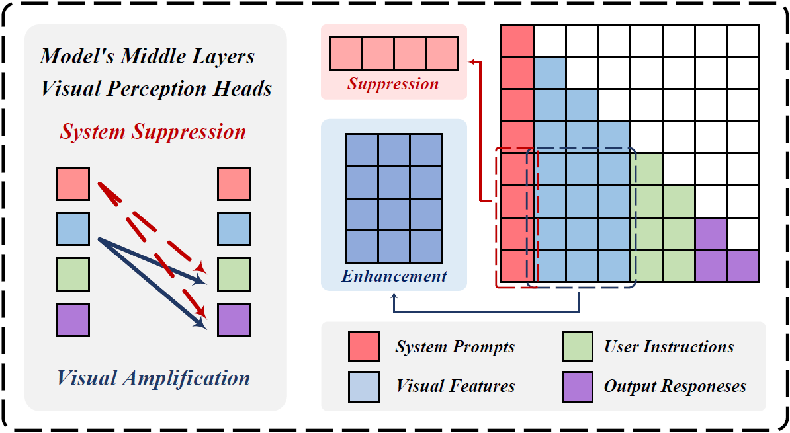
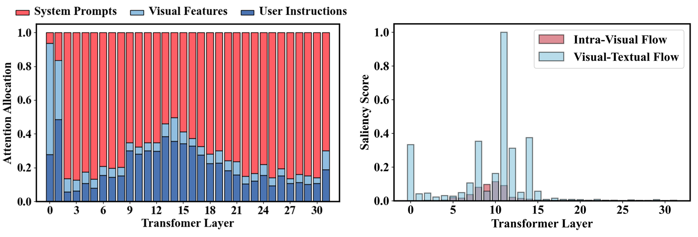
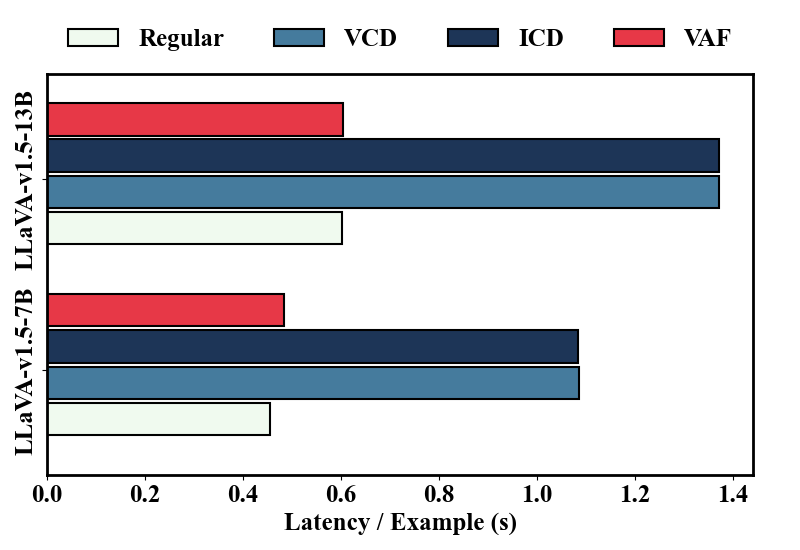

### ClearSight: Visual Signal Enhancement for Object Hallucination Mitigation in Multimodal Large language Models

---

#### Limitations of Contrastive Decoding

To address object hallucination, several Contrastive Decoding strategies have been introduced in recent years. Among these, Visual Contrastive Decoding (VCD) method has shown promise in reducing hallucinations by contrasting output distributions from both original and perturbed visual inputs, thus mitigating the model's excessive reliance on language priors. 



However, these methods present two main limitations:

- While reducing over-reliance on language priors, these methods may compromise the coherence and accuracy of generated content.

- Contrastive decoding necessitates separate processing of the original and contrastive inputs, which considerably increases inference time.

---

#### Visual Amplification Fusion

To address these shortcomings, we hope to propose a training-free method that can effectively reduces hallucinations without compromising content quality or inference speed. 



Our analysis indicates that modality fusion in MLLMs primarily occurs within the middle layers. *Visual Amplification Fusion* (VAF) specifically amplifies visual signals at these middle layers, enabling the model to capture more distinctive visual features during fusion, which in turn reduces false descriptions in generated text. 

This technique not only strengthens the model's visual representations but also retains the beneficial influence of language priors, thus preserving content quality. Furthermore, by eliminating the need to process contrastive samples, VAF maintains inference speed. 

---

- [x] Setup
- [x] Visual Neglect in Modal Fusion
- [x] VAF Inference & Evaluation

---

#### Setup

```powershell
conda create -n clearsight python=3.10
conda activate clearsight
cd LLaVA
pip install -e .
```

---

#### Visual Neglect in Modal Fusion

We provide the following script to reproduce our analysis results on the over-reliance of multimodal large language models on linguistic priors.

```powershell
bash ./visaug/analysis/vis_flow.sh
```

or

```bash
python ./visaug/analysis/vis_flow.py \
    --model-path /model/llava \
    --question-file ./data/pope/coco/coco_pope_random.json \
    --image-folder ./data/pope/coco/val2014 \
    --answers-file ./outputs/analysis/res_coco_random.pt 
```

The analysis results are shown in the two figures below, from which we can draw two key conclusions:

- The model performs the crucial fusion of visual and textual modalities in the middle layers, creating cross-modal semantic representations that drive the final predictions.

- During this critical fusion process, the model demonstrates inadequate attention to the visual modality.



---

#### VAF Inference & Evaluation

We provide the following script to reproduce the experimental results of *Visual Amplification Fusion* method.

```powershell
bash ./visaug/inference/infer_pope.sh
bash ./visaug/inference/eval_pope.sh
```

or

```bash
python ./visaug/inference/infer_pope.py \
    --model-path /model/llava \
    --question-file ./data/pope/coco/coco_pope_random.json \
    --image-folder ./data/pope/coco/val2014 \
    --answers-file ./outputs/inference/res_coco_random.jsonl \
    --use-visaug \
    --enh-para 1.15 \
    --sup-para 0.95 \

python ./visaug/inference/eval_pope.py \
    --annotation-file ./data/pope/coco/coco_pope_random.json\
    --result-file ./outputs/inference/res_coco_random.jsonl
```

*Hallucination Mitigation Results (POPE-Random-Accurancy)* 

| Method  | LLaVA-7B | LLaVA-13B | Qwen-7B  |
|:-------:|:--------:|:---------:|:--------:|
| Regular | 87.8     | 87.6      | 88.2     |
| VCD     | 88.4     | 88.9      | 89.1     |
| VAF     | **89.7** | **90.1**  | **90.0** |

*Coherence of Generated Content (Nocaps-CIDEr)*

| Method  | LLaVA-7B    | LLaVA-13B   |
|:-------:|:-----------:|:-----------:|
| Regular | 78.7        | 82.6        |
| VCD     | <u>65.7</u> | <u>68.9</u> |
| VAF     | 78.8        | 82.3        |

*Inference Speed (Nocaps)* 


